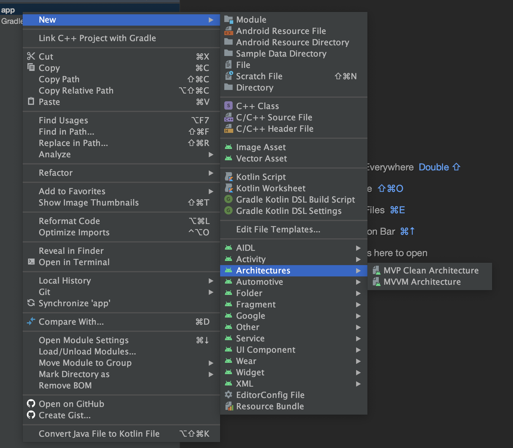

# tools-android-studio-template



------

### How to install when you are using Android Studio Arctic Fox version?

###### Step 1.
```
Copy the folder fileTemplates to ./idea
```

https://www.jetbrains.com/help/idea/using-file-and-code-templates.html

### How to install when you are using older Android Studio version?

#### Mac

###### Step 1.
```
git clone https://github.com/thalesbm/android-studio-template.git
```

###### Step 2.
```
cp -R android-studio-template/MVVM\ Template /Applications/Android\ Studio.app/Contents/plugins/android/lib/templates/other/
```

###### Step 3.
```
cp -R android-studio-template/MVP\ Clean\ Template /Applications/Android\ Studio.app/Contents/plugins/android/lib/templates/other/
```

------

#### Windows

###### Step 1.
```
git clone https://github.com/thalesbm/android-studio-template.git
```

###### Step 2.
```
Copy those folders to {ANDROID_STUDIO_LOCATION}/plugins/android/lib/templates/other/
```

